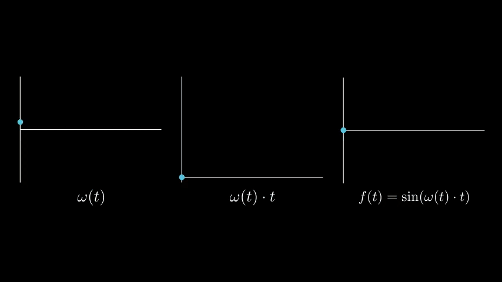
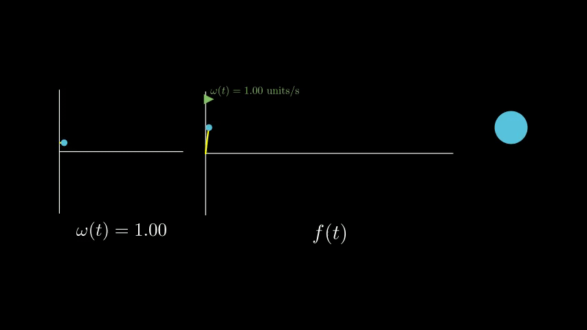

# Variable Frequency Oscillation

A function for varying the frequency of an oscillating function over time, and a Maya expression that implements it.

## The Function

Let's say we have a function $f(t)$ that we're using to animate the position of an object over time. If we wanted to make the object bounce up and down, we could model that using $f(t) = sin(\omega t)$, where $t$ is the current time and $\omega$ is the angular frequency (which defines how fast the object oscillates):

This works fine when $\omega$ is constant, but what if we want to make the object speed up and slow down as it wiggles? Instead of a constant $\omega$, we would need a function $\omega (t)$ that defines what the angular frequency should be at a given time:

Now we have a new question: how should we define $f(t)$? The first thing we could try is plugging $\omega (t)$ into the function we had before, which would give us $f(t) = sin(\omega (t) \cdot t)$. However, doing so gives us some unwanted behavior:

When the value of $\omega (t)$ is constant, $f(t)$ behaves the way we want it to. But as soon as $\omega (t)$ starts changing, $f(t)$ starts oscillating much faster than it should for the current $\omega$ value. Then, it abruptly slows down once $\omega$ becomes constant again. To understand why this happens, we can look at how $\omega(t) \cdot t$ changes over time:

When $\omega (t)$ is constant, $\omega(t) \cdot t$ increases linearly with $t$. But once $\omega (t)$ starts increasing too, it multiplies with the already increasing $t$ to create a significant jump in the overall rate of change of $\omega(t)\cdot t$. The function $f(t) = sin(\omega t)$ is only able to model oscillating motion when $\omega$ is constant. In order to vary $\omega$ over time, we're going to need to find a different function.

In order to do this, it can be helpful to change how we think about the effect that $\omega$ has on $f(t)$. A common way of understanding $\omega$ is to think of it as controlling the "stretchiness" of the function. Lower $\omega$ values expand it, resulting in slower oscillation, and higher $\omega$ values compress it, resulting in faster oscillation:

However, we can also think of $\omega$ as setting the rate at which we traverse the horizontal axis when evaluating $f(t)$. The graph of $f(t)$ is modelled differently, but the final outcome for the oscillating object is the same:

This way of thinking about $\omega$ is a bit more convoluted than the stretchiness model, but it creates an interesting property: we are now thinking of $\omega$ as a velocity, which means we can integrate it to get a position. 

If $\omega (t)$ represents the rate at which we're traversing the horizontal axis, then $\int_{0}^t \omega (t) \\, dt$ represents the current horizontal position at time $t$. That essentially means that $\int_{0}^t \omega (t) \\, dt$ is an expression that tells us what number to plug in to our oscillating function in order to model a changing $\omega$. In other words, it's our solution:

$$ f(t) =sin(\int_{0}^t \omega (t) \\, dt) $$

Now we can revisit our examples from before with our new definition for $f(t)$. If we look at how $\int_{0}^t \omega (t) \\, dt$ changes over time, we see a smooth transition instead of the sharp one that $\omega (t) \cdot t$ yielded:

And when we apply this animation to our oscillating object, we get the desired result:

As an additional way to check our work, we can look at how our new function reacts if $\omega(t)$ is constant. Lets set $\omega(t)$ to a constant function:
$$ \omega(t) = \omega_1 $$
Then $\int_{0}^t \omega (t) \\, dt$ evaluates as follows:
$$\int_{0}^t \omega (t) \\, dt = \int_{0}^t \omega_1 \\, dt = \omega_1t$$
So we end up with:
$$f(t) =sin(\int_{0}^t \omega (t) \\, dt) = sin(\omega_1t)$$
Which is the same function that we started with when $\omega$ was constant. This makes $f(t)=sin(\omega t)$ a special case of the more general function $ f(t) =sin(\int_{0}^t \omega (t) \\, dt) $.

## Applications

While I used $sin$ as an example, this general process applies to any function that animates over time. For any continuous function $g(t)$, an integrable function $\omega(t)$ can be used to change the rate at which $g(t)$ is traversed:

$$ f(t) =g(\int_{0}^t \omega (t) \\, dt) $$

Here's an example using a noise function:

Another interesting property of this method is that negative $\omega$ values will reverse the traversal direction of $g(t)$, which can be used to create symmetry: